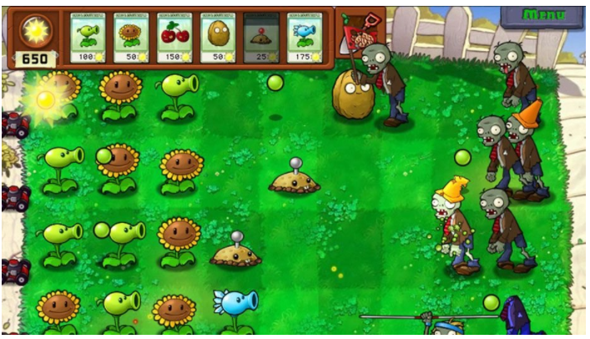
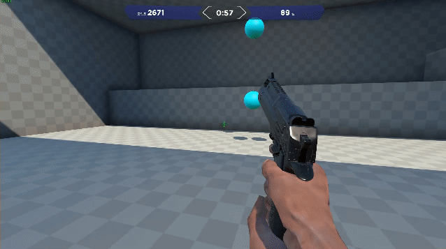
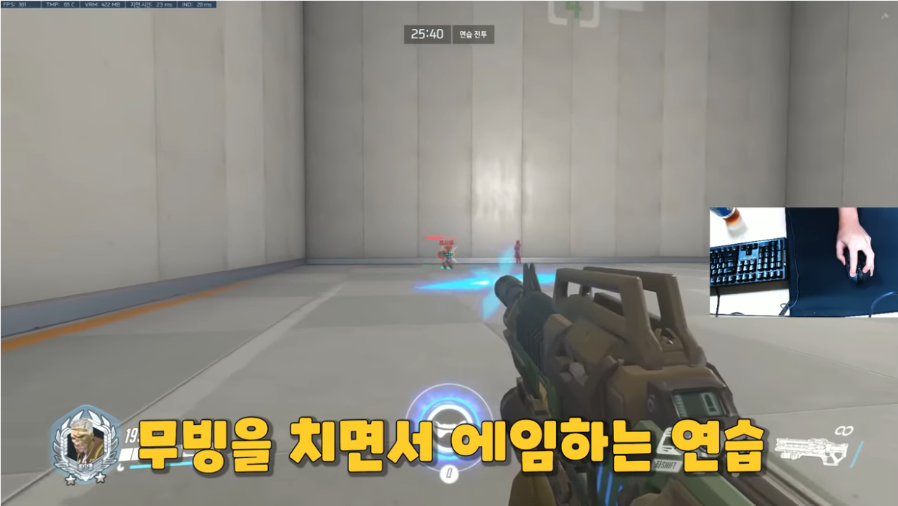
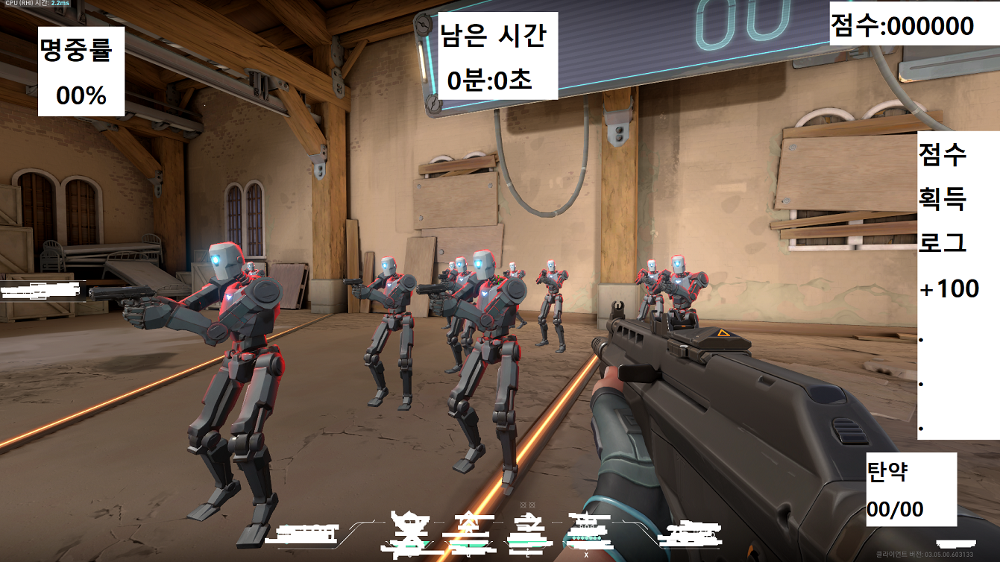
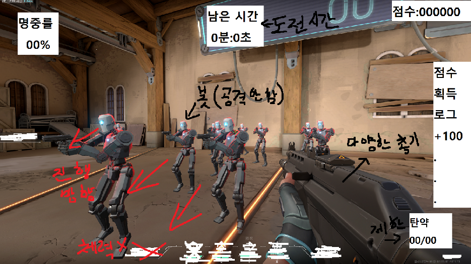
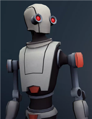
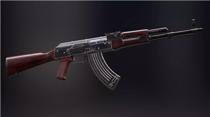
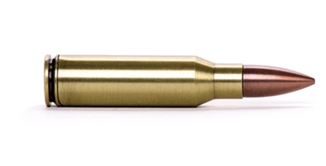
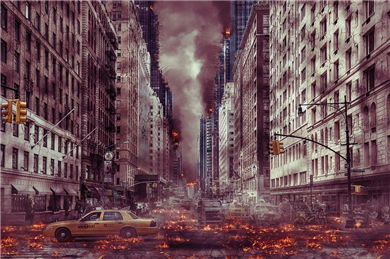
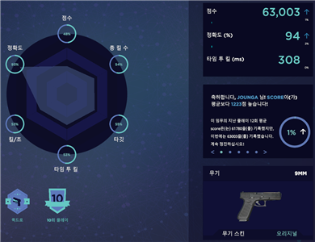

# 프로젝트명: Passing Bot

# [ 목차 ]
### 1. [컨셉](#1)
### 2. [관련 이미지와 동영상](#2)
### 3. [대표 이미지 그리고 컨셉과 대표이미지 기반 작품 묘사](#3)
### 4. [Passing Bot의 구성 요소](#4)
### 5. [게임 시스템 디자인](#5)

# [컨셉] 

## 메인컨셉 : 도전

  - 기록 경신을 통해 성취감을 얻을 수 있음
  - 도전도 제한이 없다면 연습이 될 수 있음

### 서브 컨셉 1 : 총기

  - 플레이어 마다 선호하는 총기가 다르므로 다양한 총기를 선택할 수 있도록 함
  - 총기별로 점수를 따로 적용
  - 탄약에 제한을 두어 난사하여 클리어 할 수 없도록 조절

### 서브 컨셉 2 : 봇(적)

  - 타격시 신체 부위별로 데미지가 증가하거나 감소함
  - 시간이 지날수록 체력 혹은 이동속도가 빠른 봇이 등장 하는 등 게임의 난이도를 서서히 증가시켜 재미를 느낄 수 있도록 함
  - 지정된 곳에서 생성되어 지정된 곳으로 이동하며 

### 서브 컨셉 3 : 점수

  - 머리를 맞춰서 봇을 죽였을 경우 점수를 추가로 획득
  - 시간이 지날수록 나오는 봇들의 수준이 높아지는 만큼의 점수를 추가로 획득
  - 플레이어의 실력을 객관적으로 볼 수 있음

### 서브 컨셉 4 : 사운드

  - 시원한 타격감을 플레이어에게 전달하는 수단
  - 게임을 진행하며 나오는 BGM

### 서브 컨 5 : 통계

  - 도전 종료 후 결과 창에서 점수와 함께 명중 및 처치관련 통계를 제공.
  - 자신의 부족한 부분 혹은 전략을 알 수 있음

  

# [관련 이미지 & 동영상] 

- 이미지
  
  
  
- 동영상 
  
  
  
  

# [대표 이미지]

  

# [컨셉 & 대표이미지 기반 작품묘사] 

> ### 대표이미지 기반 

> ### 컨셉 기반 

  도전 : 도전을 통해 자신의 실력이 늘어나고 있음을 느꼈을 때의 성취감이 목표

  총기 : 플레이어마다 선호하는 총기가 다르므로 다양한 총기를 선택 할 수 있도록 하고 탄약에 제한을 두어 더욱 신중한 플레이를 할 수 있도록 함

  봇(적) : 타격시 부위별로 데미지가 증감하며 시간이 지날수록 체력이나 이동속도 등이 오르며 난이도를 증가시킴/플레이어를 공격하지 않음

  점수 : 도전을 끝마쳤을 때 플레이어가 직관적으로 본인의 수준을 알 수 있게 해주는 지표

  사운드 : 시원한 타격감을 플레이어에게 전달하는 수단/지루할 수도 있는 도전 중 긴장감을 끌어 올려줄 bgm

  통계 : 점수와 함께 본인의 부족한 부분 등을 알 수 있고 전략을 수정할 수도 있음

  
# [<Passing Bot> 구성 요소] 

  - 제한시간동안 봇들을 최대한 많이 처치하여 점수를 높이는 1인칭 슈팅 게임.

 

## 1. 메커니즘 

[도전 과제]

  1. 제한시간내에 봇들을 최대한 처치해라
  2. 봇들이 목표지점까지 도달하기전에 처치해라

[재미 요소]

  1. 약점(머리)를 공격하면 높은 데미지와 처치에 성공한다면 많은 점수를 준다
  2. 일정시간이 지나면 이동속도 및 체력이 증가한 봇이 등장한다.
  3. 플레이어가 죽는다는 부담감 없이 봇들을 처치할 수 있다.
  4. 탄약에 제한이 있어 탄약관리를 해야한다.

 

## 2. 이야기

  [스토리]  
  -인간과 봇 두 진영사이에서 일어난 전쟁은 봇 측의 사령탑을 무너뜨린 인간측의 승리로 마무리 되었다.
  봇측의 명령권자가 사라지자 봇들은 공격(적대)행위를 멈췄으나 도심을 배회하는 봇들은 언제든 명령권자가
  생기면 위험해 질 수 있으므로 인간측은 봇들을 처리하는 클리너(플레이어)를 고용했다.

  [만들게 된 배경]  
  -대중적이면서도 진입장벽이 높은 FPS장르에서 플레이어가 죽는다는 부담감없이 마음껏 총을 쏘며 적을 제거한다는 것을
  점수를 제공하여 자신의 한계에 도전할 수 있는 환경을 만들고 싶어 해당 게임 프로젝트를 진행하게 되었습니다.

  [카메라 관점]  
  -FPS즉 1인칭 슈팅 게임으로 1인칭으로 진행된다.

 

## 3. 미적요소

  [디자인][컬러]  
  -스토리에 맞도록 도심을 배경으로 전쟁이 끝난 이후 이므로 회색의 색감을 이용하여 폐허의 느낌을 부여
  총기 디자인은 기존에 익숙한 총기 시리즈를 가져온다.

  -봇들은 기본의 색상에서 붉은 느낌을 준 체력이 늘어난 봇과 파란 느낌을 준 이동속도가 빠른 봇

[음향]  
  -총기마다 다른 사운드
  
  -적에게 타격시 타격감을 높이는 사운드와 머리를 타격했을시 약점을 맟췄다는 느낌을 강조하는 타격사운드
  
  -신나는 BMG
 

## 4. 기술

-유니티엔진을 이용하여 PC용 게임으로 개발
  
    
# [ 게임시스템디자인 ] 
  
## 1. 게임 오브젝트 분해 (구성 요소 분석)

|연번|오브젝트 이름|오브젝트 이미지|
|:----:|:----:|:----:|
|1|봇||
|2|총||
|3|총알||
|4|배경||
|5|통계||

   
## 2. 파라미터(속성) 뽑아 보기
  
  ### 1) 오브젝트 이름 : bot
  
|속성|영문명칭|설명|
|:----:|:----:|:----:|
|타입|bot_type|봇의 타입을 나타낸다. 0 = 기본, 1 = 이동속도 강화, 2 = 체력강화|
|체력|bot_hp|봇의 체력을 나타낸다. 기본 = 100, 이동속도 타입 = 80, 체력 타입 = 150|
|이동속도|bot_speed|봇의 이동속도를 나타낸다. 기본 = 1.0, 이동속도 타입 = 1.5, 체력 타입 = 0.8|
|점수|bot_score|봇을 처치시 획득하는 점수를 나타낸다. 기본 = 100, 이동속도 타입 = 200, 체력 타입 = 200|
|머리|bot_head|봇의 피격 부위 중 머리를 나타낸다.|
|몸|bot_body|봇의 피격 부위 중 몸을 나타낸다.|
|팔|bot_arm|봇의 피격 부위 중 팔을 나타낸다.|
|다리|bot_leg|봇의 피격 부위 중 다리을 나타낸다.|
  
  ### 2) 오브젝트 이름 : gun
  
|속성|영문명칭|설명|
|:----:|:----:|:----:|
|총기 타입|gun_type|총기의 타입을 나타낸다. 0 = M4A1, 1 = AK47, 2 = Revolver|
|대미지|gun_damage|총기의 대미지를 나타낸다.|
|탄약|gun_ammo|주어지는 탄약의 총합을 나타낸다.|
|현재 탄약|gun_current_ammo|총기의 현재 탄약을 나타낸다.|
|최대 탄약|gun_maxlmum_ammo|한 탄창에 들어갈 수 있는 최대 탄약을 나타낸다. 0 = 30, 1 = 30, 2 = 6|
|보유 탄약|gun_extra_ammo|재장전 가능한 탄약을 나타낸다.|
|연사력|gun_rateoffire|총기의 연사력을 나타낸다.|
|반동|gun_recoil|총기의 반동을 나타낸다.|
|재장전|gun_reload|총기의 재장전을 나타낸다.|
|재장전 시간|gun_reload_time|총기의 재장전 시간을 나타낸다.|

  ### 3) 오브젝트 이름 : bullet
  
|속성|영문명칭|설명|
|:----:|:----:|:----:|
|속도|bullet_speed|발사된 총알의 속도를 나타낸다.|
|대미지|bullet_damage|총알의 대미지를 나타낸다.|
|머리 대미지|bullet_hit_head|머리 부위의 피격판정을 나타낸다.|
|몸통 대미지|bullet_hit_body|몸통 부위의 피격판정을 나타낸다.|
|팔 대미지|bullet_hit_arm|팔 부위의 피격판정을 나타낸다. 0 = 왼쪽, 1 = 오른쪽|
|다리 대미지|bullet_hit_leg|다리 부위의 피격판정을 나타낸다. 0 = 왼쪽, 1 = 오른쪽|
  
  ### 4) 오브젝트 이름 : background
  
|속성|영문명칭|설명|
|:----:|:----:|:----:|
|자동차|car|자동차를 나타낸다.|
|신호등|traffic_light|신호등을 나타낸다.|
|가로등|street_lamp|가로등을 나타낸다.|

  ### 5) 오브젝트 이름 : statistics
  
|속성|영문명칭|설명|
|:----:|:----:|:----:|
|명중률|accuracy|명중률을 나타낸다.|
|약점명중률|critical_hit|머리 명중률을 나타낸다.|
|점수|score|현재 점수를 나타낸다.|
|타격 부위|hit_part_count|타격한 부위를 나타낸다.|
 
   
## 3. 행동 뽑아 보기
  
  ### 1) 오브젝트 이름 : bot
  
|행동|설명|
|:----:|:----:|
|스폰|스폰지점에서 생성된다.|
|이동|스폰지점에서 목표지점으로 이동한다.|
|사망|hp가 0이 될 경우 사망하여 소멸한다.|
|이동완료|목표지점으로 이동할 경우 소멸한다.|
  
  ### 2) 오브젝트 이름 : gun
  
|행동|설명|
|:----:|:----:|
|발사|플레이어가 좌클릭을 누르면 총알을 발사된다.|
|재장전|현재 탄약을 최대 탄약으로 변경한다.|
|발사 안됨|현재 탄약이 0일 경우 혹은 재장전상태일 때 발사가 되지 않는다.|
  
  ### 3) 오브젝트 이름 : bullet
  
|행동|설명|
|:----:|:----:|
|발사|플레이어가 좌클릭을 누르면 총알이 발사된다.|
|타격|총알이 봇에 맞으면 hp를 감소시킨다.|
|소멸|총알이 봇 혹은 오브젝트에 적중하거나 일정시간 이후 소멸한다.|

  ### 4) 오브젝트 이름 : background
  
|행동|설명|
|:----:|:----:|
|피격|총알이 해당 오브젝트에 적중했을 경우 피격자국이 남는다.|

 
## 4. 상태 뽑아 보기

  ### 1) 오브젝트 이름 : bot
  
|현상태|전이상태|전이조건|
|:----:|:----:|:----:|
|존재하지 않음|생성|시간|
|생성|사망|hp가 0이 됐을 때|
|생성|소멸|목표지점에 이동했을 때|
|사망|소멸|사망 후 일정 시간이 지날 때|
  
  ### 2) 오브젝트 이름 : gun
  
 |현상태|전이상태|전이조건|
|:----:|:----:|:----:|
|발사 가능 상태|발사 불가능 상태|현재탄약이 0일 때|
|재장전 상태|발사 가능 상태|재장전을 하여 현재 탄약이 1이상 일때|
|발사 가능 상태|재장전 상태|재장전 키를 누를 때|
|발사 불가능 상태|재장전 상태|발사키 혹은 재장전 키를 누를 때|

  
  ### 3) 오브젝트 이름 : bullet
 |현상태|전이상태|전이조건|
|:----:|:----:|:----:|
|발사|타격|타격에 성공 했을 때|
|발사|소멸|일정시간이 지났을 때|
|타격|소멸|타격에 성공 했을 때|
  
   
  ## 5. 플레이어 캐릭터 속성(파라미터)

|속성|영문명칭|설명|
|:----:|:----:|:----:|
|총|gun|선택된 총기를 나타낸다.|
|점수|score|현재 점수를 나타낸다.|
|탄약|ammo|탄약을 나타낸다.|
|명중률|accuracy|명중률을 나타낸다.|
|약점명중률|critical_hit|머리 명중률을 나타낸다.|
  
   
  ## 6. 게임의 규칙
  
  1) 핵심 규칙
  -3분이 지나거나 남은 탄약이 0이 될 때까지 봇을 처치한다.
  
  2) 보조 규칙
  -봇을 처치하면 점수를 얻는다.
  -봇이 목표지점에 도달하면 점수를 잃는다.
  -일정량의 탄약이 게임시작과 함께 주어진다.
  
   
  ## 7. 게임에서 사용될 공식
  
  -재장전
  보유 탄약+현재 탄약-최대 탄약 -> 현재 탄약 = 최대 탄약

  -점수
  현재점수+획득점수

  -명중률(%)
  봇에게 적중한 횟수/탄약-(현재 탄약+보유 탄약)*100

  -약점 명중률(%)
  약점에 명중한 횟수/봇에게 적중한 횟수*100

  
  
